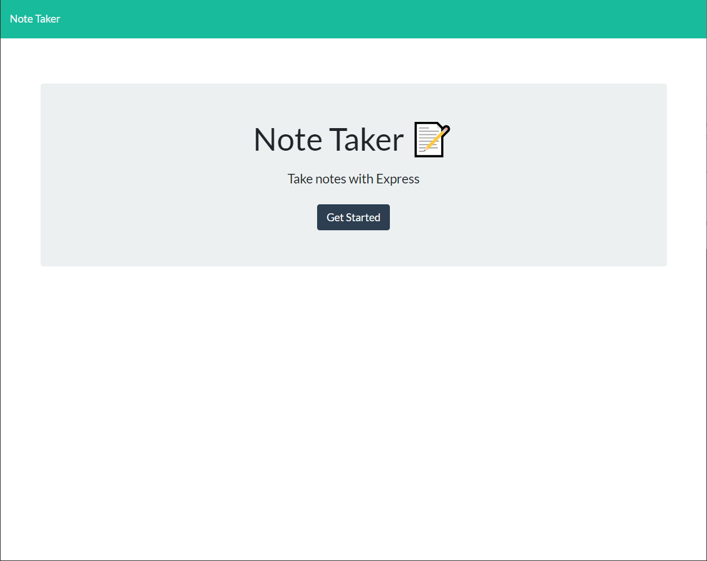
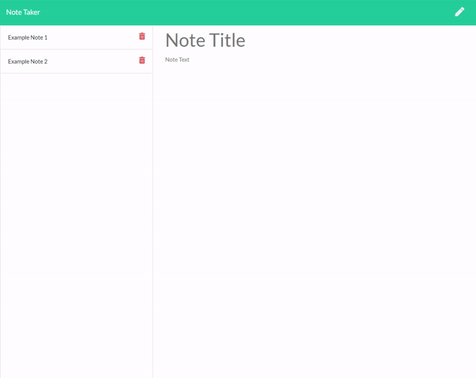
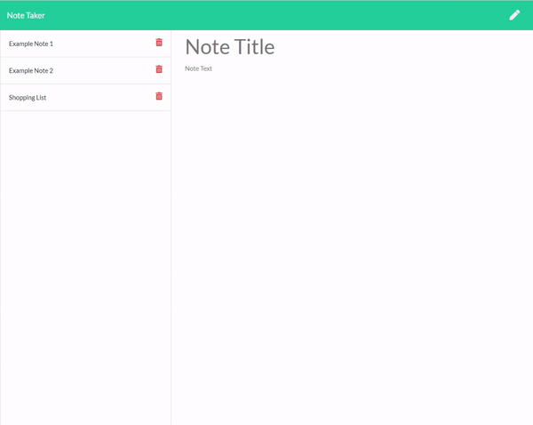

# [Note Taker - https://zar-note-taker.herokuapp.com/](https://zar-note-taker.herokuapp.com/)

## Description
An Express program to manage a web interface between a note repository and user inputs. Information is saved onto the server so data is persistent between sessions and visible regardless of connection device

## Table of Contents

1. [Usage](#2-usage)
2. [License](#3-license)
3. [Contributing](#4-contributing)
4. [Questions](#5-questions)

## 1 Usage

* [Create Note](#create-note)
* [Delete Note](#delete-note)
* [Read Notes](#read-notes)

#### Create Note

* Clicking the 'Create New Note' button (pencil in top right corner) will create a blank note to fill in with information
* Once the note is completed, clicking the 'Save note' button (disc in top right corner) will commit the note to memory

***
#### Delete Note

* Clicking the 'Delete note' button will remove the note from memory

***

#### Read Notes

* Clicking on a note located on the left side of the window will display the contents of the note

***

## 2 License
    Copyright © 2020 Chris Zarlengo
    Permission to use, copy, modify, and/or distribute this software for any
    purpose with or without fee is hereby granted, provided that the above
    copyright notice and this permission notice appear in all copies.

    THE SOFTWARE IS PROVIDED "AS IS" AND THE AUTHOR DISCLAIMS ALL WARRANTIES
    WITH REGARD TO THIS SOFTWARE INCLUDING ALL IMPLIED WARRANTIES OF
    MERCHANTABILITY AND FITNESS. IN NO EVENT SHALL THE AUTHOR BE LIABLE FOR ANY
    SPECIAL, DIRECT, INDIRECT, OR CONSEQUENTIAL DAMAGES OR ANY DAMAGES
    WHATSOEVER RESULTING FROM LOSS OF USE, DATA OR PROFITS, WHETHER IN AN ACTION
    OF CONTRACT, NEGLIGENCE OR OTHER TORTIOUS ACTION, ARISING OUT OF OR IN
    CONNECTION WITH THE USE OR PERFORMANCE OF THIS SOFTWARE.

## 3 Contributing
* [Zarlengo](https://github.com/Zarlengo)

## 4 Questions
* [Github Profile for Zarlengo](https://github.com/Zarlengo)
* [Send email to christopher@zarlengo.net](mailto:christopher@zarlengo.net)
* [File an issue](https://github.com/Zarlengo/Note-Taker/issues)
